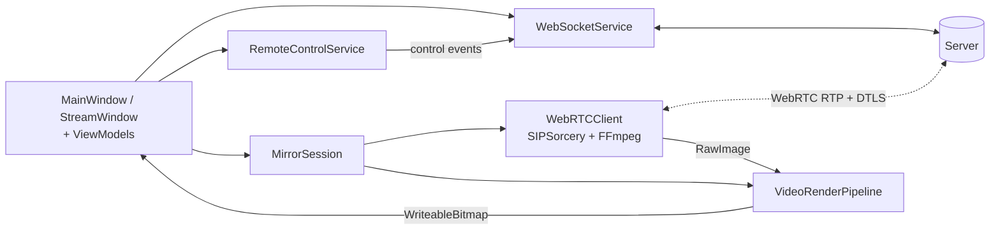
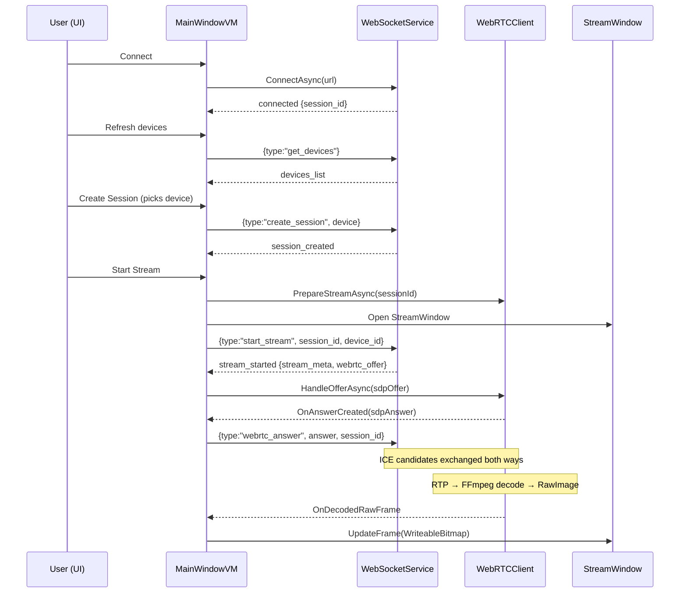
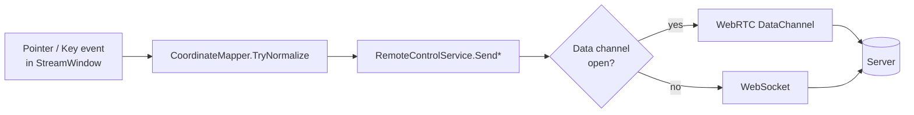

# DESKTOP APP

`MobileStreamDesktop/` — Cross-platform Avalonia / .NET 10 GUI that mirrors
a remote device in real time and forwards touch/keyboard input.

---

## 1. Purpose

A live-mirror client for the WebSocket server. It:

- Connects to the server over WebSocket.
- Discovers devices, creates a session, starts a stream.
- Receives H.264 over WebRTC, decodes via FFmpeg, renders to an Avalonia canvas.
- Sends touch/keyboard events back over the same WebSocket (or WebRTC
  DataChannel, if opened by the server).

## 2. Technologies

| Package | Version | Role |
|---|---|---|
| .NET SDK | 10.0 | Target framework |
| `Avalonia` (+ Desktop / Fluent / Inter) | 12.0.3 | Cross-platform UI |
| `SIPSorcery` | 10.0.7 | WebRTC (RTCPeerConnection, ICE, DTLS) |
| `SIPSorceryMedia.FFmpeg` | 10.0.7 | H.264 decode via FFmpeg |
| `SIPSorceryMedia.Abstractions` | 10.0.7 | Video/audio types |
| `Microsoft.Extensions.Logging` | 10.0.7 | Internal log routing |

Native dependency: **FFmpeg 8.x shared libraries** (see §9).

## 3. Architecture



**MVVM.** `MainWindowViewModel` owns all orchestration; the `StreamWindow`
is opened programmatically only when a stream is running.

## 4. Folder structure

```
MobileStreamDesktop/
├── Program.cs                       Avalonia entry point
├── App.axaml(.cs)                   App shell — instantiates MainWindow
├── MainWindow.axaml(.cs)            Control panel (connect / devices / logs)
├── StreamWindow.axaml(.cs)          Live-mirror window + touch/keyboard
├── MobileStreamDesktop.csproj        .NET project + packages
├── FFmpeg.Windows.targets           MSBuild target: auto-downloads FFmpeg 8.1 DLLs
├── app.manifest                     Windows DPI + UAC manifest
├── Services/
│   ├── WebSocketService.cs          Persistent WS client + receive loop
│   ├── WebRTCClient.cs              SIPSorcery peer + FFmpeg endpoint + H.264 gate
│   ├── RemoteControlService.cs      Tap / swipe / key / text senders
│   ├── CoordinateMapper.cs          Pointer px → normalized [0,1] device coords
│   ├── GeometryModel.cs             Letterbox + rotation math
│   ├── StreamMeta.cs                Parsed from stream_started
│   ├── StreamMetrics.cs             Rolling FPS + drop counter
│   ├── VideoFrameConverter.cs       BGRA/BGR/RGB → Avalonia framebuffer
│   ├── VideoFrameInfo.cs            Ref-counted decoded frame wrapper
│   ├── ServerMessageJson.cs         JSON extraction helpers
│   └── IosHomeIndicatorGestureRecognizer.cs
├── Streaming/
│   ├── MirrorSession.cs             WebRTCClient + RenderPipeline + Mapper
│   ├── VideoRenderPipeline.cs       AboveNormal worker → 4-bitmap pool → UI pump
│   └── LatestFrameSlot.cs           Thread-safe latest-wins slot
├── ViewModels/
│   ├── MainWindowViewModel.cs       WS/WebRTC orchestrator + all commands
│   ├── StreamWindowViewModel.cs     Stream window VM + pointer/key handlers
│   ├── DeviceOption.cs              Device descriptor
│   └── Commands/RelayCommands.cs
├── Assets/generated/                App icons
└── scripts/
    ├── generate_icons.py            Icon generation
    └── package-macos-app.sh         Builds a proper .app bundle with .icns
```

## 5. Main modules (only the ones you'll touch)

| Class | Role |
|---|---|
| `WebSocketService` | Wraps `ClientWebSocket`. Events: `OnMessageReceived`, `OnConnectionStatusChanged`, `OnError`, `OnLog`. 10 s connect timeout, 30 s keep-alive. |
| `WebRTCClient` | Owns `RTCPeerConnection` + `FFmpegVideoEndPoint`. H.264 admission gate (must see SPS → PPS → IDR before decoding). Freeze + scene-cut watchdogs. |
| `MirrorSession` | Composition root of one stream (WebRTC + render pipeline + coordinate mapper). |
| `VideoRenderPipeline` | Above-normal worker thread pulls from `LatestFrameSlot`, converts to `WriteableBitmap` from a 4-bitmap pool, dispatches to the UI thread (capped at ~60 fps). |
| `RemoteControlService` | Sends `tap` / `swipe` / `key` / `text` — prefers a `"control"` WebRTC DataChannel opened by the server; falls back to WebSocket `{type:"control"}`. |
| `CoordinateMapper` | Pointer pixel → `[0,1]` device coord, using `StreamMeta` (stream size, device logical size, rotation, letterbox). |
| `MainWindowViewModel` | Handles every server message type; exposes commands for the UI. |

## 6. Stream lifecycle



Teardown mirrors the reverse: `stop_stream` → `destroy_session` → WS close.

## 7. WebRTC overview

- **SDK**: SIPSorcery `RTCPeerConnection`; `SIPSorceryMedia.FFmpeg`
  provides the `FFmpegVideoEndPoint` used as the decode sink.
- **Codec**: H.264 only. `_videoEndPoint.RestrictFormats(IsH264Format)`
  filters other codecs out of the SDP answer.
- **ICE servers**: none (empty list). Designed for LAN — no STUN/TURN by default.
- **Path**: `OnRtpPacketReceivedByIndex` (no jitter buffer) — LAN reordering
  probability is near zero, JB adds 50–200 ms latency.
- **Admission gate** (`WebRTCClient.CanFeedPayload`): buffered SPS/PPS
  bootstrap, then must see an IDR before P-frames are decoded. Discards
  garbage before the first keyframe.
- **Decode → render**: `_videoEndPoint.GotVideoFrame` → FFmpeg native
  decoder → `RawImage` → `VideoRenderPipeline` → BGRA into a pooled
  `WriteableBitmap` → assigned to `StreamWindowViewModel.CurrentFrame`.

## 8. Input / control flow



**Messages sent** (payload shapes are the `event:` object):

| Action | Fields |
|---|---|
| `tap` | `x, y` (normalized [0,1]) |
| `swipe` | `x1, y1, x2, y2, durationMs` |
| `key` | `keyCode` (Android key name, e.g. `KEYCODE_HOME`) |
| `text` | `text` (raw string) |
| `appSwitcher` | (iOS home-indicator swipe result) |

Sent as either:
- **DataChannel** (if the server opened `"control"`): `{"event": {...}}`
- **WebSocket** fallback: `{"type":"control", "event": {...}}`

## 9. Platform-specific behavior

### Windows
- **`.csproj`** forces `<PlatformTarget>x64</PlatformTarget>` on Windows —
  FFmpeg native DLLs are x64-only.
- **`FFmpeg.Windows.targets`** auto-downloads
  [`ffmpeg-8.1-full_build-shared.zip`](https://github.com/GyanD/codexffmpeg/releases/tag/8.1)
  on first Windows build, caches under
  `%LOCALAPPDATA%\MobileStreamDesktop\ffmpeg-cache`, and copies the 7 DLLs
  into `MobileStreamDesktop\ffmpeg\win-x64\`. Validated by checking all
  seven files are present before considering the bundle valid.
- **`app.manifest`** sets DPI awareness and a matching UAC execution level.
- **`<OutputType>WinExe</OutputType>`** hides the Windows console.
- **VC++ 2015–2022 x64 redistributable** is required (`vcruntime140.dll`,
  `vcruntime140_1.dll`, `msvcp140.dll`). `WebRTCClient` validates and
  prints a diagnostic if missing.
- The `FFmpeg.Windows.targets` file is imported only when the build host is
  Windows. Cross-publishing a Windows RID from macOS/Linux does **not**
  include the DLLs automatically — see §12.

### macOS
- **FFmpeg** must be installed via Homebrew (`brew install ffmpeg`).
- `WebRTCClient.ResolveFfmpegLibPath()` probes `/opt/homebrew/lib`,
  `/opt/homebrew/opt/ffmpeg/lib`, `/usr/local/lib`, `/usr/local/opt/ffmpeg/lib`
  in order and picks the first that contains `libavutil*.dylib`.
- **Dock icon** — running the raw published binary shows a default icon.
  Use `scripts/package-macos-app.sh` to build an `.app` bundle with a
  proper `Info.plist` + `.icns`.
- No code signing / notarization in-tree.

`FFMPEG_LIB_PATH` overrides the FFmpeg search on both platforms.

## 10. Required native dependencies

**Windows** — 7 DLLs under `<exe dir>\ffmpeg\win-x64\`
(auto-copied by MSBuild target, but keep this list to reason about failures):

```
avutil-60.dll        avcodec-62.dll        avformat-62.dll
avfilter-11.dll      avdevice-62.dll       swresample-6.dll
swscale-9.dll
```

Source: Gyan `codexffmpeg` **8.1 `full_build-shared`** GitHub release.

**macOS** — `libavutil.*.dylib`, `libavcodec.*.dylib`, `libavformat.*.dylib`,
`libavfilter.*.dylib`, `libavdevice.*.dylib`, `libswresample.*.dylib`,
`libswscale.*.dylib` from `brew install ffmpeg`.

## 11. How the desktop app talks to the server

Single WebSocket connection (default `ws://localhost:8080`, configurable
in the UI). Uses the message set documented in `SERVER.md §7`:

- `get_devices` / `devices_list`
- `create_session` / `session_created`
- `start_stream` (server answers with `stream_started` **containing** the
  WebRTC offer inline, then RTP flows over the peer connection)
- `webrtc_answer`, `ice_candidate`
- `control` (fallback when the WebRTC `"control"` DataChannel isn't open)
- `stop_stream`, `destroy_session`
- Push events: `scene_cut`, `stream_stall`, `stream_resumed`, `stream_error`,
  `session_timeout`

There is **no CLI argv on the current branch** — the WS URL is set from
the UI text field. (An extension-integrated variant with
`--server / --device / --session-id / --auto-start` lives on the
`vs_code_extension` branch.)

## 12. How to build and run

**Prerequisites**
- .NET 10 SDK
- macOS: `brew install ffmpeg`
- Windows: internet on first build (auto-download) + VC++ 2015–2022 x64
  redistributable

**Dev run**

```bash
cd MobileStreamDesktop
dotnet run
```

Then in the UI: enter the WS URL → Connect → Refresh → pick device →
Create Session → Start Stream.

**Publish (per RID)**

```bash
# Windows x64
dotnet publish -c Release -r win-x64 --self-contained true

# macOS Apple Silicon
dotnet publish -c Release -r osx-arm64 --self-contained true

# macOS Intel
dotnet publish -c Release -r osx-x64 --self-contained true
```

The Windows publish output includes `ffmpeg\win-x64\` with the 7 DLLs
(via the `CopyFfmpegNativeBeforePublish` MSBuild target). **Cross-publishing
a Windows RID from macOS/Linux is not supported on this branch** — build on
a Windows host, or copy the `ffmpeg\win-x64\` folder manually beside the
`.exe`.

**macOS `.app` bundle** (correct Dock icon)

```bash
cd MobileStreamDesktop
chmod +x scripts/package-macos-app.sh
./scripts/package-macos-app.sh
open bin/Release/net10.0/osx-arm64/MobileStreamDesktop.app
```

**Environment overrides**
- `FFMPEG_LIB_PATH` — force a specific FFmpeg library directory.
- `RENDER_TARGET_FPS` — cap render UI fps (default 60, max 120).
