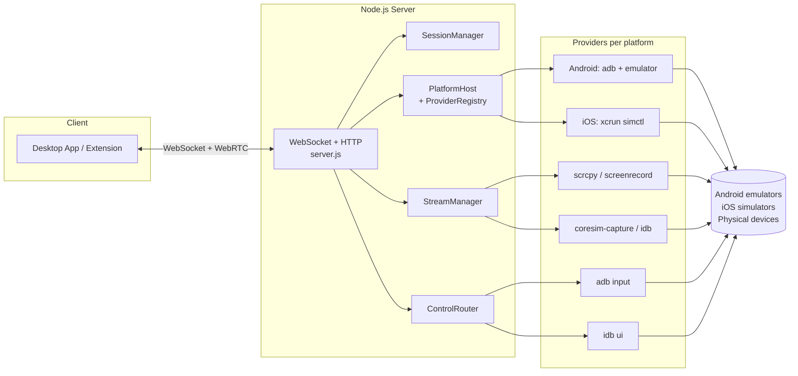
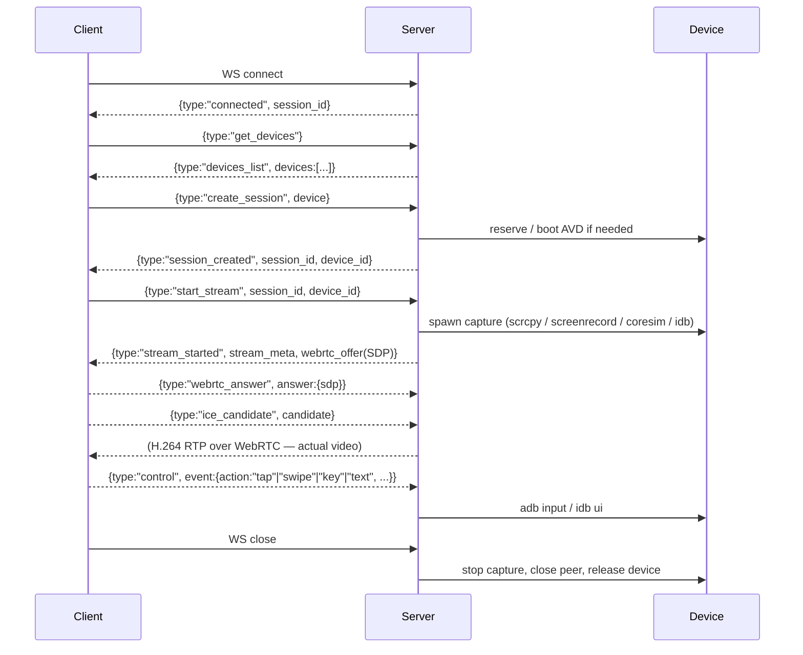
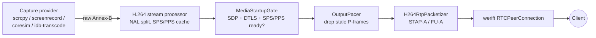

# SERVER

`MobileStreamServer` — Node.js WebSocket gateway that owns
the physical/virtual devices, streams their screens via WebRTC, and forwards
touch/keyboard input back.

---

## 1. Purpose

- Runs on the machine that has the Android SDK, Xcode, and the devices attached.
- Exposes a single WebSocket endpoint that the Desktop App (and optionally
  the VS Code extension) talks to.
- Discovers devices, reserves them per session, starts a video capture, sends
  H.264 over WebRTC, and injects input events.

## 2. Architecture



## 3. Technologies

| Runtime dep | Purpose |
|---|---|
| Node.js 18+ | Runtime |
| `ws` | WebSocket server |
| `werift` | Pure-JS WebRTC (RTCPeerConnection, DTLS, RTP send) |
| `uuid` | Session IDs |

**External binaries** (must be on `PATH`):

| Tool | Required for |
|---|---|
| `adb` | All Android device control (mandatory — server exits if absent) |
| `emulator` | Starting AVDs by name |
| `xcrun` / `simctl` | iOS simulator discovery + lifecycle (macOS only) |
| `idb` (`fb-idb`) | iOS HID input + fallback H.264 capture |
| `ffmpeg` | `adb-screenrecord` and `ios-idb-transcode` capture paths |
| `coresim-capture` | Primary iOS capture helper (Swift, must be built) |
| `scrcpy-server.jar` v2.7 | Primary Android capture (bundled at `scrcpy/scrcpy-server.jar`) |

## 4. Folder structure

```
MobileStreamServer/
├── server.js                    Entry point + all WebSocket handlers
├── sessionManager.js            Session + device-reservation registry
├── emulatorManager.js           Android AVD lifecycle
├── emulator.js, adb.js          Low-level CLI wrappers
├── devicesCatalog.js            Unified Android + iOS device list
├── webrtcSignaling.js           Signaling-state bookkeeping
├── config/
│   ├── providers.js             Priority order per capability × platform
│   └── iosDeviceSizes.js        iOS logical resolution + backing scale table
├── lib/
│   ├── config.js                All env-var driven tuning
│   ├── simctl.js                xcrun simctl wrapper
│   └── logger.js                Shared logger
├── platform/                    PlatformHost + ProviderRegistry
├── providers/
│   ├── android/                 adb discovery, emulator lifecycle, scrcpy, adb input
│   └── ios/                     simctl discovery, sim lifecycle, coresim-capture, idb HID
├── stream/
│   ├── StreamManager.js         Central pipeline coordinator
│   ├── webrtc/PeerConnection.js werift RTCPeerConnection wrapper
│   ├── media/h264/              NAL parsing, SPS/PPS cache, RTP packetization
│   ├── capture/                 ScrcpyCaptureStream, ScreenrecordCapture,
│   │                            CoreSimIOSurfaceStream, IdbTranscodeStream
│   └── core/                    MediaStartupGate, OutputPacer, CaptureSupervisor
├── control/ControlRouter.js     Routes `control` events to active capture
├── flutter/                     FlutterRunner, projectRegistry, sessionWorkspace
│                                (present on disk but NOT wired in server.js —
│                                 see §14 Notes)
├── scrcpy/scrcpy-server.jar     Pre-bundled scrcpy server (v2.7)
├── package.json                 3 runtime deps
└── .env.example                 Environment variable reference
```

## 5. Responsibilities

- **Session ownership.** One WebSocket ≙ one session ≙ at most one reserved device.
- **Device discovery + reservation.** Merges Android + iOS catalogs; enforces
  one session per device.
- **Capture + streaming.** Spawns the platform-specific capture, muxes the
  H.264 stream into WebRTC RTP, sends it to the client.
- **Input injection.** Translates `control` messages into `adb input` (Android)
  or `idb ui` (iOS) shell calls.
- **Lifecycle cleanup.** On WS close, stops the stream, closes the peer, and
  (for Android) kills the owned emulator.

## 6. Communication flow



## 7. WebSocket message reference

All messages are JSON `{ type, requestId?, ... }`. Every incoming message
gets a same-`requestId` response. Complete list of handlers registered in
`server.js`:

**Health & session:**
`ping` → `pong` · `get_session` → `session_info` ·
`create_session` → `session_created` · `destroy_session` → `session_destroyed`

**Emulator control:**
`get_emulators` · `start_emulator` · `stop_emulator` · `emulator_status`

**Device I/O:**
`get_devices` · `assign_device` · `adb_command` · `shell_command` ·
`install_apk` · `screenshot` · `reboot`

**Streaming:**
`start_stream` (server sends the offer) · `stop_stream` · `stream_status` ·
`stream_stats` · `webrtc_answer` · `ice_candidate` · `request_keyframe` ·
`control`

**Server-pushed events (no `requestId`):**
`connected`, `session_timeout`, `stream_stall` / `stream_resumed`,
`stream_error` (fatal — client must reconnect), `scene_cut` (decoder should
discard reference frames)

**Not wired:** `run_flutter`, `stop_flutter`, `flutter_hotkey` (files exist under
`flutter/` but are not registered in `server.js`; see §14).

## 8. Device management

- **Android** — `AdbDiscoveryProvider` runs `adb devices`; cross-references
  `emulator -list-avds`. Booting via `emulatorManager.getOrStartEmulator()`
  reuses an already-running AVD (`ownedBySession=false`) or spawns a new
  one and polls `adb devices` until online.
- **iOS** — `SimctlDiscoveryProvider` runs `xcrun simctl list --json`;
  lifecycle uses `xcrun simctl boot` + opens the `Simulator.app`.
- **Reservation** — `sessionManager.deviceToSession` map. A live session
  owning a device is respected; a stale (disconnected) owner is reclaimed
  automatically so a crashed client never permanently locks a device.
- **Cleanup on disconnect** — Android emulators owned by the session are
  killed (unless `KILL_EMULATOR_ON_DISCONNECT=false`). iOS simulators are
  deliberately **not** shut down — they stay booted for reuse.

## 9. Streaming pipeline



**Providers picked automatically** based on platform + probe results:

| Provider ID | Platform | Notes |
|---|---|---|
| `scrcpy-capture` | Android (primary) | MediaCodec H.264 over ADB TCP forward, no time limit |
| `adb-screenrecord` | Android (fallback) | `adb shell screenrecord --output-format=h264 -` piped through ffmpeg |
| `ios-coresim-iosurface` | iOS (primary) | Swift helper → CoreSim IOSurface → VideoToolbox H.264 |
| `ios-idb-transcode` | iOS (fallback) | `idb` capture piped through ffmpeg baseline transcode |

The `stream_started` message includes `stream_mode = "server_webrtc_<providerId>"`
so the client knows which pipeline is active.

Server is **always** the WebRTC offerer. STUN is disabled by default
(`USE_STUN_SERVERS=true` to re-enable) — designed for LAN use.

## 10. Session lifecycle

- **Create** — Every new WS connection gets a UUID session (`sessionManager.createSession`).
- **Active** — `state = active`, `streamState = idle → starting → streaming → stopping`.
- **Idle cleanup** — Sessions idle >1 hour are closed by the periodic
  `SESSION_CLEANUP_INTERVAL` sweep (default 5 min).
- **Heartbeat** — WS ping every `HEARTBEAT_INTERVAL` (30 s). After
  `WS_MAX_MISSED_PONGS` (3) missed pongs the socket is terminated.
- **Destroy** — WS close → stop stream → close peer → release device →
  (Android) kill emulator if owned.

Messages from the same client are serialized in a per-connection `Promise`
chain so `webrtc_answer` can never race an in-flight `start_stream`.

## 11. Configuration files

**`.env.example`** — copy to `.env` and set in the shell before launching
(the server does **not** auto-load `.env`). Key vars:

```
PORT=8080
HOST=0.0.0.0
STREAM_FPS=30
STREAM_BITRATE=6M
STREAM_PARAM_REFRESH_MS=2000
ADB_CAPTURE_MODE=auto            # auto | screenrecord
SCREENRECORD_TIME_LIMIT=86400    # seconds
KILL_EMULATOR_ON_DISCONNECT=true
USE_STUN_SERVERS=false
```

Additional tuning in `lib/config.js`:
`ANDROID_MAX_SIZE`, `ANDROID_STREAM_FPS`, `ANDROID_KEYFRAME_SEC`,
`IOS_STREAM_FPS`, `IOS_KEYFRAME_INTERVAL_SEC`, `FFMPEG_PATH`, `ADB_PATH`,
`IDB_PATH`, `CORESIM_HELPER_PATH`.

**`config/providers.js`** — priority arrays that decide which provider is
tried first per capability × platform. Edit this to change fallback order
without touching provider code.

**`flutter/` subsystem** (currently unwired) reads a `flutter-projects.json`
next to `server.js` if enabled — see §14.

## 12. How to start the server

```bash
cd MobileStreamServer
npm install
node server.js                   # or: npm start   |   npm run dev (with --watch)
```

Health check: `GET http://<host>:8080/health` → `{"status":"ok"}`.
Stats: `GET http://<host>:8080/stats`.

Persist logs by redirecting stdout:

```bash
node server.js >> server.log 2>&1
```

## 13. Tests

Node built-in test runner, no external framework:

```bash
npm test        # runs stream/core/__tests__/*.test.js
```

Test vectors for coordinate/geometry parity live in
`stream/core/geometry-test-vectors.json`. There's a companion
`tools/GeometryParity/` .NET CLI that verifies bit-identical results
between server and desktop app.

## 14. Notes for future maintenance

- **`webrtcSignaling.js` is bookkeeping only.** The real peer connection is
  `stream/webrtc/PeerConnection.js` (werift). `webrtcSignaling` only tracks
  signaling state for `stream_status` reporting.
- **Fatal on capture exit.** When a capture process dies (time limit, crash,
  device drop) the entire stream session is torn down and a
  `stream_error { fatal: true }` is sent. The server never silently
  restarts a capture; clients must reconnect.
- **Orphan cleanup at stream start** kills any lingering `screenrecord` /
  `scrcpy` on the device to avoid two competing MediaCodec encoders
  producing `stall_no_data`.
- **MediaStartupGate** holds RTP frames until SDP local + remote + DTLS +
  SPS/PPS bootstrap are all ready, plus a small `DECODER_WARMUP_MS` pause.
- **scrcpy version pinned to 2.7** — replace the JAR and update
  `SCRCPY_VERSION` in `ScrcpyCaptureStream.js` to upgrade.
- **Flutter subsystem is inert.** `flutter/FlutterRunner.js`,
  `projectRegistry.js`, `sessionWorkspace.js` implement a `flutter run`
  runner with isolated per-session workspaces, but `server.js` does not
  register `run_flutter` / `stop_flutter` / `list_projects` / `list_flavors`
  in its `messageHandlers`. To enable it, add those routes and require the
  flutter module. Requires `flutter` on the server's PATH.
- **No `.env` auto-loading.** Set env vars via the shell, a process
  manager (systemd, PM2), or wire in `dotenv` if desired.
- **STUN off by default.** Fine on LAN; set `USE_STUN_SERVERS=true` for
  NAT traversal (and open UDP in the firewall).
- **iOS simulators stay booted** across sessions on purpose. If you want
  hard shutdown, add a `simctl shutdown` call in the release path in
  `sessionManager.releaseSessionDevice()`.
- **Message handling is per-connection serialized.** A slow handler blocks
  subsequent messages from the same client — keep handlers non-blocking or
  return early.
