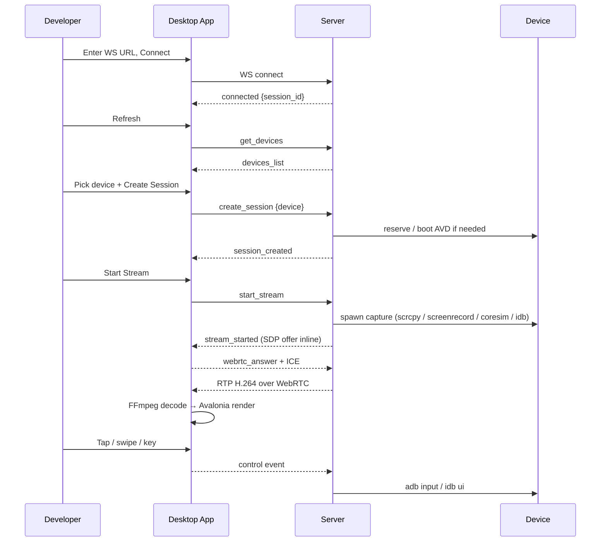

# SETUP AND RUN

End-to-end handover: how to install everything from a clean machine, run the
server + desktop app, and (optionally) the VS Code extension.

---

## 1. Prerequisites

There are two roles. They can be the **same machine** for development.

### Server machine (owns the devices)
- macOS with Xcode (needed for iOS simulators). Linux works if you only
  need Android.
- Android SDK Platform-Tools (`adb` + optionally `emulator`).
- Node.js 18+ and npm.
- `ffmpeg` on `PATH`.
- `idb` (`pip install fb-idb`) for iOS input + iOS fallback capture.
- Xcode command-line tools with `swiftc` to build the iOS capture helper.
- A `scrcpy-server.jar` (v2.7) for Android capture — checked in at
  `MobileStreamServer/scrcpy/scrcpy-server.jar`.

### Client machine (developer)
- .NET 10 SDK (to build the desktop app) — or an already-published binary.
- macOS: `brew install ffmpeg`.
- Windows x64: internet access on first build (FFmpeg auto-downloads) +
  VC++ 2015–2022 x64 redistributable installed.
- **Flutter, ADB, Xcode, and any device toolchain are NOT required on the
  client** — everything runs on the server.

## 2. Repository structure

```
remote_debug_desktop/
├── MobileStreamDesktop/            .NET 10 / Avalonia GUI (client-side)
├── MobileStreamServer/             Node.js WebSocket + WebRTC server
├── tools/GeometryParity/           .NET CLI: coord-mapping parity check
│                                  (VS Code extension source lives on the
│                                   `vs_code_extension` branch — not present here)
├── SERVER.md                      Server handover doc
├── DESKTOP_APP.md                 Desktop app handover doc
└── SETUP_AND_RUN.md               This file
```

## 3. Software checklist

| Tool | Where | How to install |
|---|---|---|
| Node.js 18+ | server | https://nodejs.org (or `nvm install 20`) |
| .NET 10 SDK | client (+ server if you also run desktop app there) | https://dotnet.microsoft.com/download |
| Android platform-tools (`adb`, optionally `emulator`) | server | Android Studio or `brew install --cask android-platform-tools` |
| Xcode + Xcode CLI tools | server (macOS, for iOS) | Mac App Store + `xcode-select --install` |
| `ffmpeg` | server + client | `brew install ffmpeg` (mac) · winget/choco (Win) · `apt install ffmpeg` (Linux) |
| `idb` | server (iOS only) | `pip install fb-idb` |
| VC++ 2015–2022 x64 runtime | Windows client | https://aka.ms/vs/17/release/vc_redist.x64.exe |

## 4. Clean-machine setup — step by step

Clone once:

```bash
git clone <repo-url> remote_debug_desktop
cd remote_debug_desktop
```

### 4a. Server

```bash
cd MobileStreamServer
npm install
```

Build the native iOS capture helper (macOS only):

```bash
cd stream/capture/ios/coresim-capture
bash build.sh
cd -
```

Verify tools:

```bash
adb version
xcrun simctl list --json  >/dev/null   # macOS only
idb --version
ffmpeg -version
```

Copy the sample env if you want to override defaults:

```bash
cp .env.example .env
# then edit .env — it is NOT auto-loaded; export the vars in your shell
# or run `env $(grep -v '^#' .env | xargs) node server.js`
```

### 4b. Desktop app

```bash
cd MobileStreamDesktop
dotnet restore
dotnet build
```

macOS additional (one-time):

```bash
brew install ffmpeg
```

Windows additional (one-time): install the VC++ x64 redistributable.

### 4c. VS Code extension (optional)

Extension source lives on the `vs_code_extension` branch. To build it:

```bash
git worktree add ../ext vs_code_extension
cd ../ext/vscode-emulator-run
npm install       # postinstall runs scripts/bootstrap.js
npm run compile
```

Build platform-specific `.vsix` files:

```bash
# Just your current OS/arch
node scripts/package.js

# A specific target
node scripts/package.js --target win32-x64
node scripts/package.js --target darwin-arm64
node scripts/package.js --target darwin-x64

# Every supported target at once
node scripts/package.js --all
```

Output: `vscode-emulator-run/dist/emulator-stream-run-<version>-<target>.vsix`.

## 5. Run the server

```bash
cd MobileStreamServer
node server.js
# or:  npm start        (equivalent)
# or:  npm run dev      (uses `node --watch`)
```

Confirm:

```bash
curl http://localhost:8080/health
# {"status":"ok",...}
```

Notes:
- Server crashes at startup if `adb` is not on `PATH`.
- Bind address is `0.0.0.0` by default so other machines on the LAN can connect.
- Redirect stdout for persistent logs: `node server.js >> server.log 2>&1`.

## 6. Install the VS Code extension

From a **pre-built `.vsix`** (production users only need this file plus VS Code):

```bash
code --install-extension emulator-stream-run-0.2.0-darwin-arm64.vsix
# or for Cursor:
cursor --install-extension emulator-stream-run-0.2.0-darwin-arm64.vsix
```

GUI alternative: Extensions sidebar → `…` menu → **Install from VSIX…** → select file.

Install the `.vsix` that **matches your OS and architecture** (`win32-x64`,
`darwin-arm64`, `darwin-x64`, …). Installing the wrong platform is
rejected by VS Code up-front.

Configure `emulatorStreamRun.server` in Settings to the server URL
(e.g. `ws://192.168.1.100:8080`).

## 7. Build the desktop app

Dev run:

```bash
cd MobileStreamDesktop
dotnet run
```

Release publish (self-contained per RID):

```bash
dotnet publish -c Release -r win-x64   --self-contained true   # Windows
dotnet publish -c Release -r osx-arm64 --self-contained true   # macOS Apple Silicon
dotnet publish -c Release -r osx-x64   --self-contained true   # macOS Intel
```

macOS `.app` bundle (proper Dock icon):

```bash
cd MobileStreamDesktop
chmod +x scripts/package-macos-app.sh
./scripts/package-macos-app.sh
open bin/Release/net10.0/osx-arm64/MobileStreamDesktop.app
```

⚠️ Windows FFmpeg DLLs are only auto-copied when the build **host** is
Windows. Cross-publishing a Windows RID from macOS/Linux does not bundle
the DLLs on this branch — build on a Windows machine or copy the
`ffmpeg\win-x64\` folder manually beside `MobileStreamDesktop.exe`.

## 8. Connect everything together

**Same machine, quick test:**

1. Start the server: `node server.js` (window 1)
2. Boot / attach a device: an Android AVD, a physical device via USB, or an iOS simulator.
3. Run the desktop app: `dotnet run` (window 2)
4. In the app: `ws://localhost:8080` → **Connect** → **Refresh Devices** →
   pick a device → **Create Session** → **Start Stream**.

**Two machines (server + client):**

1. Start the server on machine A (`node server.js`, note its LAN IP).
2. Open port 8080 (TCP) on machine A's firewall. If you enable STUN
   (`USE_STUN_SERVERS=true`), also open the UDP ports used for RTP.
3. On machine B, run the desktop app and use
   `ws://<machine-A-LAN-IP>:8080`.

**With the VS Code extension** (only on the `vs_code_extension` branch):

Instead of starting the desktop app manually, press **F5** inside a
Flutter project. The extension will connect to the server, pick a device,
optionally start `flutter run` remotely (if the flutter subsystem is
wired — see `SERVER.md §14`), and open the desktop app streaming window
automatically.

## 9. End-to-end execution flow



## 10. Common issues and quick fixes

| Symptom | Likely cause | Fix |
|---|---|---|
| Server exits immediately: `ADB is not available` | `adb` not on PATH on server machine | Install Android platform-tools, or set `ADB_PATH` in `.env` |
| `Device X is already in use by another user` | Another live session owns it | Pick a different device, or close the other session |
| Client connects but "No devices returned" | Server started before devices were plugged in / booted | Boot the AVD / plug in the device, then click **Refresh** |
| Stream never starts (`stall_no_data`) on Android | Orphaned scrcpy or screenrecord on the device | Restart the stream — the server auto-kills orphans on the next `start_stream`. Manually: `adb shell pkill -KILL screenrecord scrcpy` |
| iOS simulator capture fails | `coresim-capture` helper not built | `cd MobileStreamServer/stream/capture/ios/coresim-capture && bash build.sh` |
| iOS capture falls back to laggy `idb-transcode` | `coresim-capture` present but VideoToolbox rejected the pixel format | Check server logs; ensure the simulator is booted and visible to `xcrun simctl` |
| Windows desktop app: `Unable to find FFMPEG binaries` | The 7 Gyan codexffmpeg DLLs are missing next to the `.exe` | Rebuild on a Windows machine, OR manually place the 8.1 `full_build-shared` DLLs into `<exe dir>\ffmpeg\win-x64\`, OR set `FFMPEG_LIB_PATH` |
| Windows desktop app crashes at startup with missing `vcruntime140.dll` | VC++ x64 redistributable not installed | Install [VC++ 2015–2022 x64 redist](https://aka.ms/vs/17/release/vc_redist.x64.exe) |
| macOS desktop app: FFmpeg not found | Homebrew FFmpeg missing or in an unusual location | `brew install ffmpeg`, or set `FFMPEG_LIB_PATH` |
| macOS desktop app runs but Dock icon is generic | Launching the raw binary, not the `.app` bundle | Run `scripts/package-macos-app.sh` and open the `.app` |
| Extension: `Unsupported platform` at install | Wrong-platform `.vsix` | Install the matching `<target>.vsix` for your OS/arch |
| Extension: `The bundled MobileStreamDesktop binary is missing` | Same as above, discovered at F5 time | Install the correct platform `.vsix`, or set `emulatorStreamRun.desktopAppPath` to a locally-built binary |
| Connection works locally but not across LAN | Firewall / STUN | Open TCP 8080 on the server; enable `USE_STUN_SERVERS=true` and open UDP ports if going across NAT |
| Stream starts but black screen / `videoRtp=0` / ICE failed | WebRTC UDP blocked or wrong network path | **Do not use Cloudflare/ngrok for video** — they only proxy WebSocket. Use `ws://<server-lan-ip>:8080` with both machines on the **same LAN**. If the Mac has multiple NICs (Wi‑Fi + hotspot), set `WEBRTC_ANNOUNCE_IPS=<lan-ip>` before starting the server |
| Server log: `sent: 0` / `DTLS not ready` | ICE/DTLS never completed | Same as above — client cannot reach server's UDP candidates. Restart server after setting `WEBRTC_ANNOUNCE_IPS` |

## 11. Troubleshooting checklist

Before opening an issue, check in this order:

1. **Server side.**
   `curl http://<server>:8080/health` → must return `{"status":"ok"}`.
   Watch `server.log` (or the terminal) as you retry.

2. **Devices visible on server.**
   ```bash
   adb devices                       # Android
   xcrun simctl list --json | jq     # iOS (macOS)
   ```

3. **Desktop app can reach the server.**
   Ping the server host from the client; if `ws://…:8080` errors immediately
   it's usually a firewall or wrong IP.

4. **Native deps on the client.**
   - macOS: `ls /opt/homebrew/lib/libavutil*`
   - Windows: `dir <exe dir>\ffmpeg\win-x64\avutil-60.dll`

5. **Stream starts but freezes.**
   Look for `stream_stall` messages in the server log. The server tries to
   recover on next input; if a capture process exits, you'll see
   `stream_error {fatal:true}` — reconnect from the client.

6. **iOS/Android input mismapped.**
   Restart the stream. `stream_meta` (resolution + rotation) is captured
   at stream start; if the device rotates mid-session, the coordinate
   mapping stays with the old rotation.

7. **VS Code extension: doctor.**
   Command Palette → **Emulator Stream: Doctor**. Prints the resolved
   server URL, discovered devices, bundled desktop app path, and any
   staleness reason.
